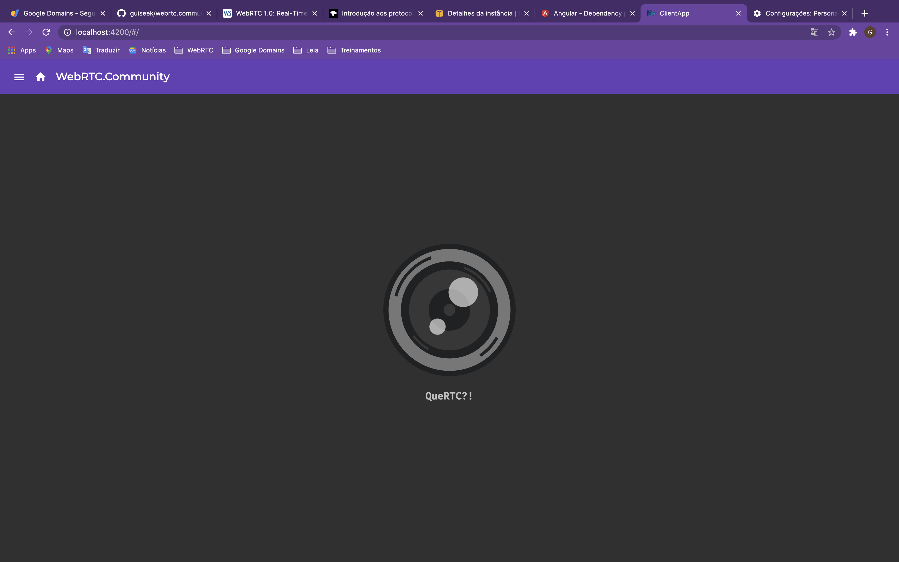
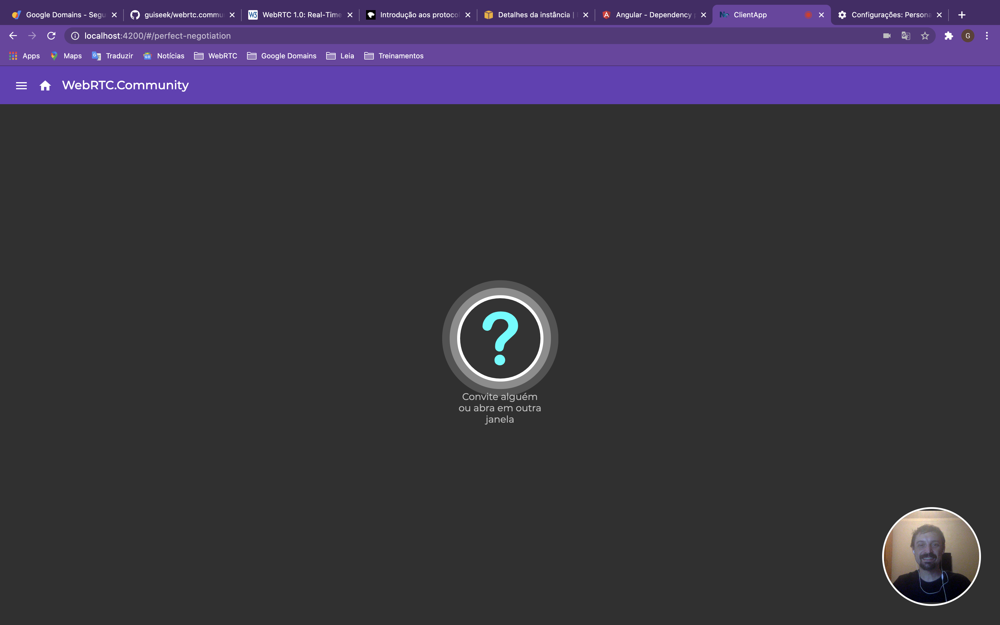

# QueRTC?

### Repositório criado para estudos sobre WebRTC

- Traduções de partes relevantes da especificação [w3c webrtc](https://www.w3.org/TR/webrtc/)
- Reproduções da especificação ou exemplos do [repositório oficial](https://github.com/webrtc/samples)

## Exemplos reproduzidos até agora

- [Negociação perfeita](./apps/client/src/app/containers/perfect-negotiation)
- [Reiniciar candidatos](./apps/client/src/app/containers/restart-ice)
- [Ponto-a-ponto](./apps/client/src/app/containers/peer-to-peer)

---

|                        |                                                      |                                               |
| ---------------------- | ---------------------------------------------------- | --------------------------------------------- |
|  |  |  |
| _Home_                 | _Negociação perfeita_                                | _Reiniciar candidatos_                        |

---

# Comunidade

## Sugestões

Tem uma sugestão sobre algum exemplo para reprodução? [Abra uma solicitação](https://github.com/guiseek/quertc/issues/new) para que possamos providenciar.

### Discussões

uer entender melhor algum tópico? [inicie uma discussão](https://github.com/guiseek/quertc/discussions/new) para que outras pessoas coloquem seus pontos de vista.

## Execute

Instale com `npm install`

Faça o build com `npm run build`

O resultado estará nos diretórios dentro de `dist`

Teste com `npm run dev`

---

## Desenvolva

Execute com `npm run dev`

Escreva testes com `npm run tdd`

---

## Estrutura

```sh
apps
├── client
│   ├── src
│   │   ├── app
│   │   │   ├── adapters
│   │   │   │   └── signaling.adapter.ts # <- SignalingChannel (Adapter adapter)
│   │   │   ├── app.component.html
│   │   │   ├── app.component.ts
│   │   │   ├── app.module.ts
│   │   │   ├── components
│   │   │   ├── containers
│   │   │   │   ├── peer-to-peer
│   │   │   │   │   ├── README.md # <- Ponto a ponto
│   │   │   │   │   ├── peer-to-peer.component.html
│   │   │   │   │   └── peer-to-peer.component.ts
│   │   │   │   ├── perfect-negotiation
│   │   │   │   │   ├── README.md # <- Negociação perfeita
│   │   │   │   │   ├── perfect-negotiation.component.html
│   │   │   │   │   └── perfect-negotiation.component.ts
│   │   │   │   └── restart-ice
│   │   │   │       ├── README.md # <- Reiniciar candidato
│   │   │   │       ├── restart-ice.component.html
│   │   │   │       └── restart-ice.component.ts
│   │   │   ├── home
│   │   │   │   ├── home.component.html
│   │   │   │   ├── home.component.scss
│   │   │   │   └── home.component.ts
│   │   │   └── utilities
│   │   │       └── signaling.utils.ts
│   │   ├── index.html
│   │   ├── main.ts
│
└── server
    ├── src
    │   ├── api.gateway.spec.ts
    │   ├── api.gateway.ts # <- Retransmite mensagens  (socket.io)
    │   ├── app.module.ts
    │   └── main.ts
libs
└── core
    ├── src
    │   ├── index.ts
    │   └── lib
    │       ├── signaling-channel.interface.ts
    │       └── signaling-channel.ts # <- SignalingChannel (agnóstico)
```
